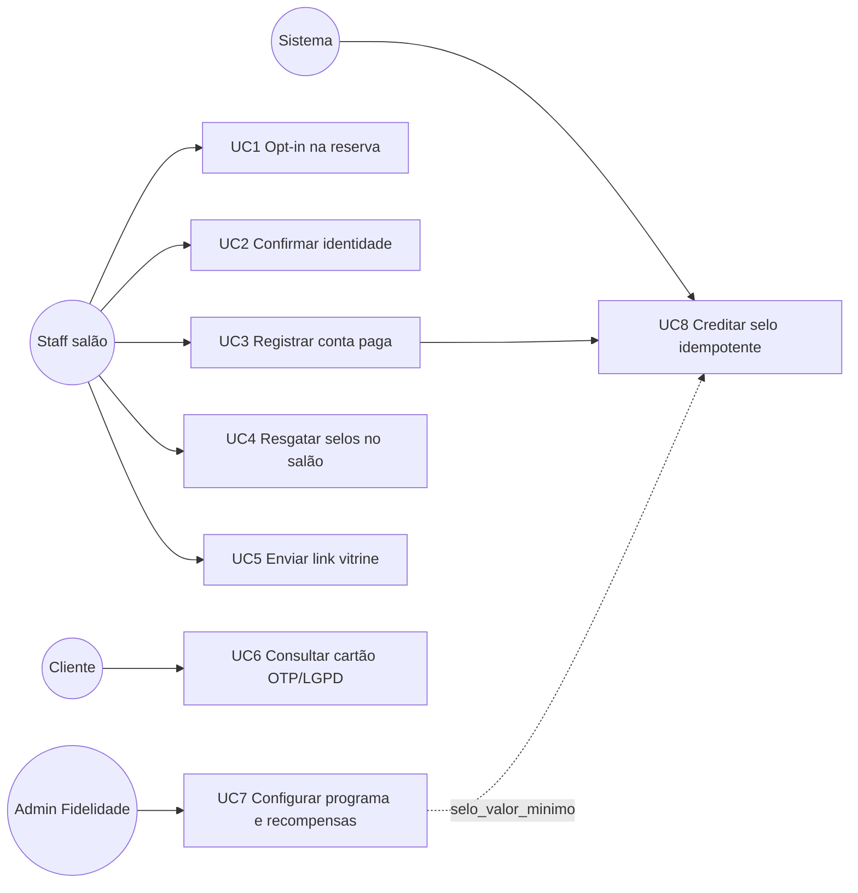
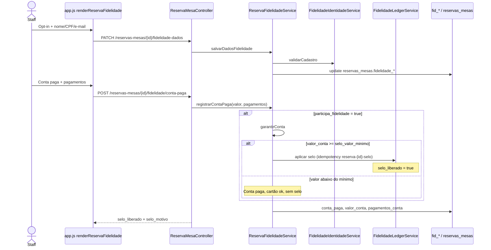
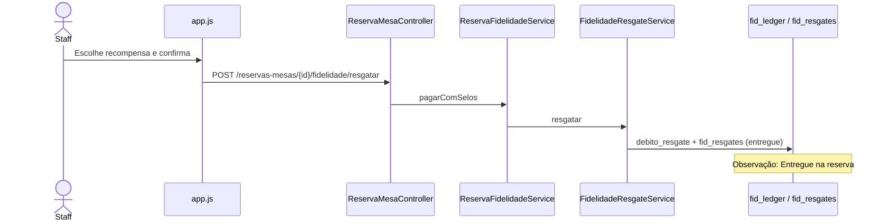
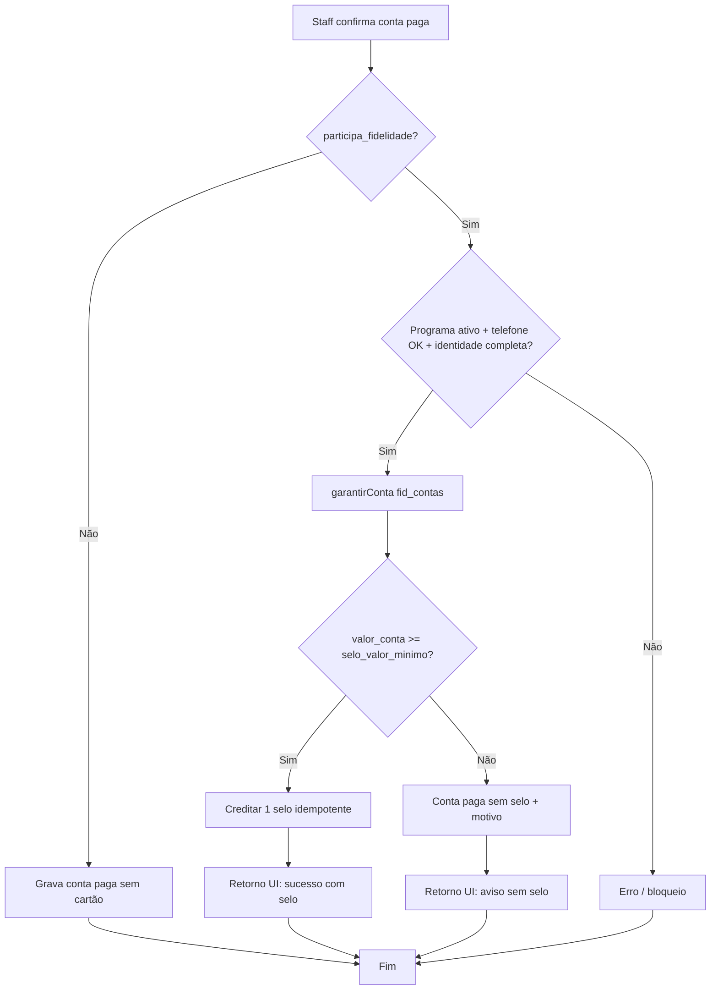
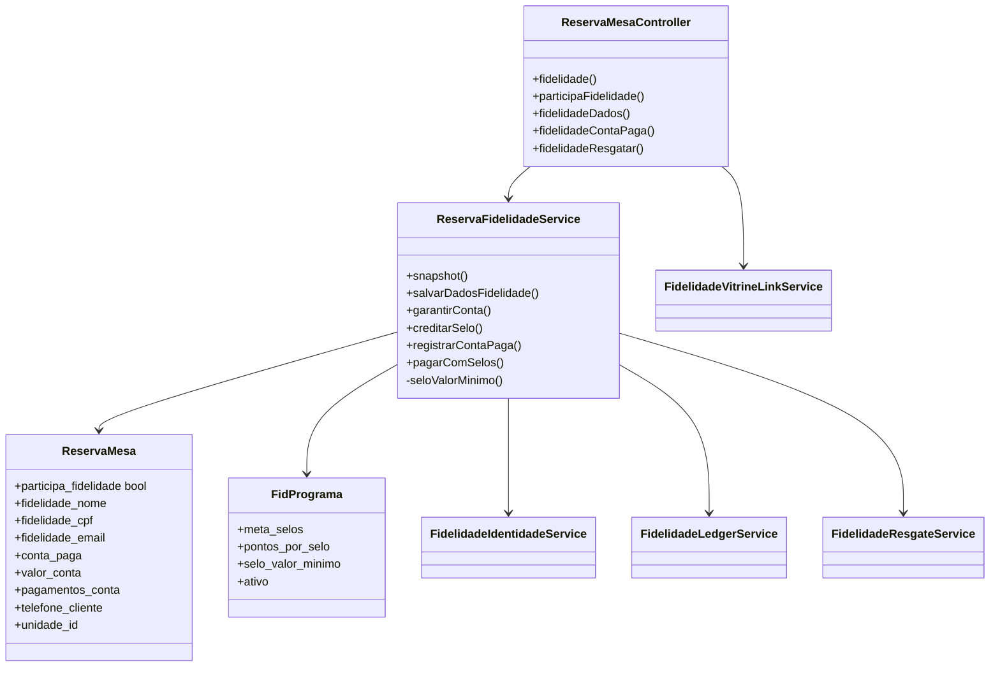

# Treinamento: Reserva ↔ Fidelidade

Material para apresentação e diagramas UML (casos de uso, sequência, classes e atividade).

**Projeto:** SAS Estoque (`sas-estoque-laravel`)  
**Data:** 2026-07-20 (rev. 2 — regra valor mínimo do selo)  
**Público:** equipe de salão, suporte e quem configura Fidelidade  
**Escopo:** integração **Reserva de Mesa** × **Programa de Fidelidade**

Arquivos deste pacote:

| Arquivo | Uso |
|---------|-----|
| `RESERVA_FIDELIDADE_INTERACAO.md` | Este documento (treinamento + Mermaid) |
| `RESERVA_FIDELIDADE_INTERACAO.pdf` | PDF para projeção / impressão |
| `RESERVA_FIDELIDADE_UML.puml` | PlantUML (abrir em plantuml.com ou IDE) |

---

## Slide 1 — Mensagem em uma frase

> No salão, a **Reserva** registra opt-in e **conta paga**; o **Fidelidade** guarda cartão e selos; a ponte é o **`ReservaFidelidadeService`**.  
> O cliente ganha **1 selo** por reserva participante **somente se** o valor da conta for **≥ “Libera selo a partir de”** (padrão **R$ 100**, configurável no programa).

---

## Slide 2 — Visão geral dos módulos

| Módulo | Papel | Onde aparece |
|--------|-------|--------------|
| **Reserva** | Agenda mesa, visita, **conta paga** no salão | Painel Reserva → bloco fidelidade (`app.js` → `renderReservaFidelidade`) |
| **Fidelidade** | Programa, cartão por telefone, ledger, recompensas | Admin Fidelidade (`fidelidade.js`) + tabelas `fid_*` |
| **Ponte** | Liga os dois de forma síncrona | `ReservaFidelidadeService` via `ReservaMesaController` |

**Regras de ouro para o treinamento**

1. **Não** há Events/Jobs Laravel entre Reserva e Fidelidade — tudo é chamada direta na API.
2. **Delivery** usa outra ponte (`DeliveryPedidoFidelidadeService`) no **mesmo cartão** `fid_contas` — canal irmão, não misturar no fluxo do salão.
3. LGPD/OTP ficam na **vitrine pública** (`/loja/{slug}/fidelidade/*`), não nas telas de Reserva do staff.
4. Chave do cartão: **`(unidade_id, telefone_normalizado)`**.

---

## Slide 3 — Atores

| Ator | O que faz no dia a dia |
|------|------------------------|
| **Cliente** | Aceita participar (verbal); informa nome/CPF/e-mail; depois pode abrir o link da vitrine (`?origem=reserva`) |
| **Staff / salão** | Opt-in, dados, conta paga, resgate, envio do WhatsApp |
| **Admin Fidelidade** | Configura programa (meta, pontos, **Libera selo a partir de**) e recompensas |
| **Sistema** | Idempotência do selo, validação de identidade, vínculo loja↔unidade para a URL |

---

## Slide 4 — Casos de uso (UML)

| UC | Nome | Ator | Resultado esperado |
|----|------|------|--------------------|
| UC1 | Opt-in na reserva | Staff | `participa_fidelidade` + dados em `reservas_mesas` |
| UC2 | Identidade | Staff | Nome + CPF + e-mail válidos (`FidelidadeIdentidadeService`) |
| UC3 | Conta paga | Staff | Pagamentos gravados; se opt-in → cartão; selo **se valor ≥ mínimo** |
| UC4 | Resgate no salão | Staff | Débito no ledger + resgate `entregue` |
| UC5 | Link vitrine | Staff | URL / WhatsApp (`FidelidadeVitrineLinkService`) |
| UC6 | Consulta pública | Cliente | OTP + LGPD na vitrine Delivery |
| UC7 | Config programa | Admin | `fid_programas` incl. **`selo_valor_minimo`** + `fid_recompensas` |
| UC8 | Selo | Sistema | `fid_ledger` tipo `selo`, chave `reserva-{id}-selo` |

---

## Slide 5 — Roteiro operacional no salão (passo a passo)

1. Abrir a **reserva** do cliente (telefone já preenchido).
2. Marcar **participa do fidelidade**.
3. Preencher e **salvar** nome completo, CPF e e-mail.
4. Ao fechar a mesa: informar **valor da conta** + formas de pagamento → **Conta paga**.
5. Sistema:
   - cria/atualiza o **cartão** (`fid_contas`);
   - se valor ≥ mínimo do programa → credita **1 selo** (idempotente);
   - se valor &lt; mínimo → conta paga **sem selo** (mensagem clara na tela).
6. (Opcional) **Resgatar** recompensa com selos no próprio painel.
7. (Opcional) Enviar **link WhatsApp** para o cliente ver o cartão na vitrine.

---

## Slide 6 — Regra de negócio: valor mínimo do selo

| Configuração | Onde | Padrão |
|--------------|------|--------|
| **Libera selo a partir de (R$)** | Fidelidade → Programa → campo `selo_valor_minimo` | **100,00** |
| Valor `0` | Mesmo campo | Libera selo em **qualquer** valor de conta |

**Comportamento na conta paga (com opt-in)**

| Situação | Conta paga? | Cartão? | Selo? |
|----------|-------------|---------|-------|
| Valor ≥ mínimo | Sim | Sim (cria se preciso) | **Sim** (+1) |
| Valor &lt; mínimo | Sim | Sim | **Não** (`selo_liberado=false` + motivo) |
| Sem opt-in | Sim | Não | Não |
| Conta já paga (replay) | Já estava | — | Não credita 2º selo |

Idempotência: chave `reserva-{id}-selo` — mesmo se o staff repetir a ação, **não** gera segundo selo.

---

## Slide 7 — Sequência UML: conta paga com fidelidade

### Sequência — resgate no salão

---

## Slide 8 — Diagrama de atividade (decisão do selo)

---

## Slide 9 — Classes e relacionamentos

---

## Slide 10 — APIs (Reserva → Fidelidade)

| Método | Rota | Serviço |
|--------|------|---------|
| GET | `/api/reservas-mesas/{id}/fidelidade` | `snapshot()` |
| PATCH | `/api/reservas-mesas/{id}/participa-fidelidade` | opt-in |
| PATCH | `/api/reservas-mesas/{id}/fidelidade-dados` | `salvarDadosFidelidade()` |
| POST | `/api/reservas-mesas/{id}/fidelidade/conta-paga` | `registrarContaPaga()` |
| POST | `/api/reservas-mesas/{id}/fidelidade/resgatar` | `pagarComSelos()` |
| POST | `/api/reservas-mesas/{id}/fidelidade/selo` | `creditarSelo()` — **API só; UI não chama** |
| POST | `/api/reservas-mesas/{id}/fidelidade/garantir` | `garantirConta()` — **API só; UI não chama** |

Admin do programa (inclui mínimo do selo): rotas em `fidelidade_routes.php` → `FidelidadeController::putPrograma`.

---

## Slide 11 — Fluxo de dados

### Reserva → Fidelidade

| Dado | Origem | Destino |
|------|--------|---------|
| `unidade_id` | reserva | escopo `fid_programas` / `fid_contas` |
| Telefone | `telefone_cliente` | `fid_contas.telefone_normalizado` |
| Nome/CPF/e-mail | `fidelidade_*` | `fid_contas` |
| Valor da conta | `valor_conta` | gate do selo vs `selo_valor_minimo` |
| Selo | 1 selo + `pontos_por_selo` | `fid_ledger` (`tipo=selo`, `referencia_tipo=reserva_mesa`) |

### Fidelidade → UI Reserva

| Dado | Uso na tela |
|------|-------------|
| `selo_valor_minimo` | Texto da regra / confirmação |
| programa, meta, saldo | Progresso e resgate |
| `selo_ja_creditado` | Idempotência |
| `selo_liberado` / `selo_motivo` | Toast sucesso ou aviso |
| URL / WhatsApp vitrine | Cliente consulta cartão |

---

## Slide 12 — Tabelas e migrations

### Tabelas

- Reserva: `reservas_mesas`, `reserva_meios_pagamento`
- Fidelidade: `fid_programas` (**`selo_valor_minimo`**), `fid_contas`, `fid_ledger`, `fid_recompensas`, `fid_resgates`
- Vitrine: `dlv_loja_config.unidade_fidelidade_id`

### Migrations relevantes

| Migration | Efeito |
|-----------|--------|
| `2026_07_17_140000_create_fidelidade_tables.php` | Core `fid_*` |
| `2026_07_18_130000_add_conta_paga_to_reservas_mesas.php` | Gate conta paga |
| `2026_07_18_160000_add_pagamentos_conta_to_reservas_mesas.php` | JSON pagamentos |
| `2026_07_18_170000_create_reserva_meios_pagamento.php` | Meios + tipo `resgate_fidelidade` |
| `2026_07_18_180000_add_unidade_fidelidade_id_to_dlv_loja_config.php` | Loja ↔ unidade |
| `2026_07_18_190000_add_participa_fidelidade_to_reservas_mesas.php` | Opt-in |
| `2026_07_18_200000_add_fidelidade_dados_to_reservas_mesas.php` | Identidade |
| `2026_07_20_140000_add_selo_valor_minimo_to_fid_programas.php` | **Valor mínimo para liberar selo** |

---

## Slide 13 — Edge cases (perguntas frequentes)

| Situação | Comportamento |
|----------|---------------|
| Programa inativo | Conta paga sem selo (ou erro se opt-in exigir programa) |
| Telefone &lt; 10 dígitos | Sem cartão / sem selo |
| Nome/CPF/e-mail incompletos | Bloqueia cartão/selo |
| CPF/e-mail em outro telefone (mesma unidade) | Validação impede |
| Conta R$ 80 com mínimo R$ 100 | Conta paga, cartão ok, **sem selo** |
| Conta R$ 100+ | **+1 selo** |
| Conta já paga | Replay; não muda opt-in/dados; não 2º selo |
| `POST .../selo` manual | Exige valor ≥ mínimo; UI do salão **não** usa |
| Mesmo telefone no Delivery | Mesmo `fid_contas`; `referencia_tipo` diferente |

**LGPD:** no caminho Reserva o staff não marca checkbox LGPD; o cliente faz isso ao entrar na vitrine.

---

## Slide 14 — Reserva vs Delivery (não confundir)

| | Reserva (salão) | Delivery |
|--|-----------------|----------|
| Ponte | `ReservaFidelidadeService` | `DeliveryPedidoFidelidadeService` |
| Gatilho do selo | Staff marca **conta paga** + valor ≥ mínimo | Opt-in no checkout / sucesso do pedido |
| LGPD no join | Não | Sim |
| `referencia_tipo` | `reserva_mesa` | `delivery_pedido` |
| Cartão compartilhado? | Sim (mesmo telefone + unidade) | Sim |

---

## Slide 15 — Arquivos-chave (para desenvolvimento / suporte)

| Camada | Caminho |
|--------|---------|
| Ponte | `backend/app/Services/Fidelidade/ReservaFidelidadeService.php` |
| API Reserva | `backend/app/Http/Controllers/ReservaMesaController.php` |
| Admin programa | `backend/app/Http/Controllers/Fidelidade/FidelidadeController.php` |
| UI Reserva | `frontend/app.js` → `renderReservaFidelidade` |
| Admin Fid | `frontend/fidelidade.js` (campo “Libera selo a partir de”) |
| PlantUML | `docs/RESERVA_FIDELIDADE_UML.puml` |

---

## Como montar a apresentação

1. Use os **Slides 1–6** para público operacional (salão).
2. Use os **Slides 7–9** (UML) para quem desenha processo / TI.
3. Use **Slides 10–15** como anexo técnico.
4. Importe `RESERVA_FIDELIDADE_UML.puml` no [PlantUML Online](https://www.plantuml.com/plantuml) ou VS Code para exportar imagens dos diagramas.
5. PDF pronto: `RESERVA_FIDELIDADE_INTERACAO.pdf`.
